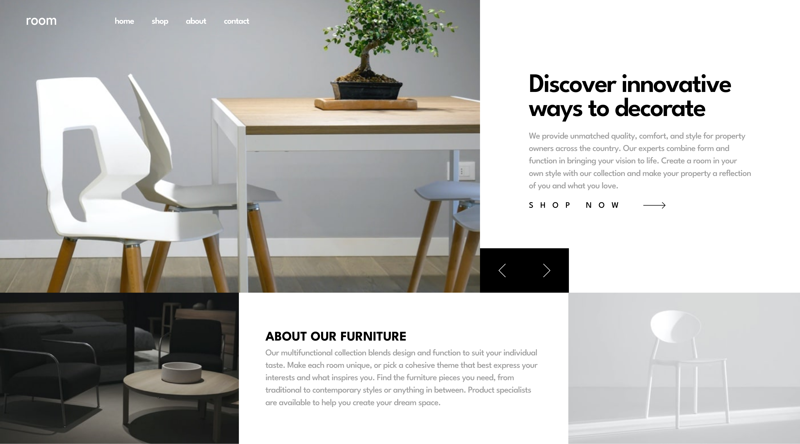

# Frontend Mentor - Room homepage solution

This is a solution to the [Room homepage challenge on Frontend Mentor](https://www.frontendmentor.io/challenges/room-homepage-BtdBY_ENq). Frontend Mentor challenges help you improve your coding skills by building realistic projects. 

## Table of contents

- [Overview](#overview)
  - [The challenge](#the-challenge)
  - [Screenshot](#screenshot)
  - [Links](#links)
- [My process](#my-process)
  - [Built with](#built-with)
  - [What I learned](#what-i-learned)
  - [Continued development](#continued-development)
  - [Useful resources](#useful-resources)
  - [AI Collaboration](#ai-collaboration)
- [Author](#author)


## Overview

### The challenge

Users should be able to:

- View the optimal layout for the site depending on their device's screen size
- See hover states for all interactive elements on the page
- Navigate the slider using either their mouse/trackpad or keyboard

### Screenshot




### Links

- Solution URL: [Add solution URL here](https://your-solution-url.com)
- Live Site URL: [Add live site URL here](https://frontend-mentor-room-homepage-main.netlify.app/)

## My process

### Built with

-Semantic HTML5: Prioritized accessibility and structure.

-Modular SCSS: Used a modern @use and @forward architecture with folder-based modules (abstracts, base, layout).

-CSS Grid: Implemented a "Master Grid" on the <main> element to handle the complex multi-column and layout transitions.

-Mobile-First Workflow: Built for mobile first and layered on complexity for tablet and desktop using custom mixins.

-Vanilla JavaScript: Refactored for a DRY (Don't Repeat Yourself) slider logic.

**Note: These are just examples. Delete this note and replace the list above with your own choices**

### What I learned

One of the major highlights was taming the "wandering" slider buttons. I initially struggled with absolute positioning percentages, but found a much more resilient solution by treating the buttons as a direct child of the CSS Grid. By docking them with align-self: end, they stayed pixel-perfect regardless of the window size.
```css
.hero__btns {
  position: absolute;
  display: flex;
  bottom: 50%;
  right: 0;

  @include breakpoint(large) {
    position: unset;
    grid-column: 2;
    grid-row: 1;
    align-self: end;
  }

}

```

I also implemented Accessible Dynamic Content by using `aria-live="polite"` and `aria-atomic="true"`. This ensures that screen reader users are notified whenever the hero carousel changes, creating a truly inclusive experience.

```html
<div class="wrapper" aria-live="polite" aria-atomic="true"></div>
```


### Continued development

- Smooth Transitions: My next step is to add CSS transitions to the carousel images for a more "premium" feel. Or perhaps, use framer-motion.
- Focus Management: I want to ensure that when the mobile menu is open, the user's focus is "trapped" inside the menu for better keyboard accessibility.


### Useful resources

- [Sass folder structure](https://dev.to/technoph1le/a-modern-sass-folder-structure-330f) - This helped me come up with my Sass folder structure. I'll be using this in every project that includes SASS.
- [Using mixins with scss to create breakpoints](https://dev.to/oler/using-mixins-with-scss-to-create-breakpoints-8g6) - This ariticle taught me how to write a flexible sass breakpoint mixin, taking advantage of the if and else statements and the @content rule.
- [Make your css variable names suck less](https://www.fixate.it/blog/make-your-css-variable-names-suck-less) - This teaches you to name your css/scss variables according to their purpose. I refer to this from time to time.


### AI Collaboration

I used the Google's antigravity editor for this project, because of its assorted and affordable AI models. I asked the agent to go through the AGENTS.md file, for it to be a support tool.
From the initialization of the project, to performance and SEO optimization, it assisted me in the decision making processes, pointed out faults, threw a few mind grenades, commended me and allowed me make my mistakes and improve.
I would be doing this for the rest of my projects.


## Author

- Website - [Add your name here](https://www.your-site.com)
- Frontend Mentor - [@yourusername](https://www.frontendmentor.io/profile/Tejiri-A)
- Twitter - [@_tejiri_a](https://www.twitter.com/_tejiri_a)

